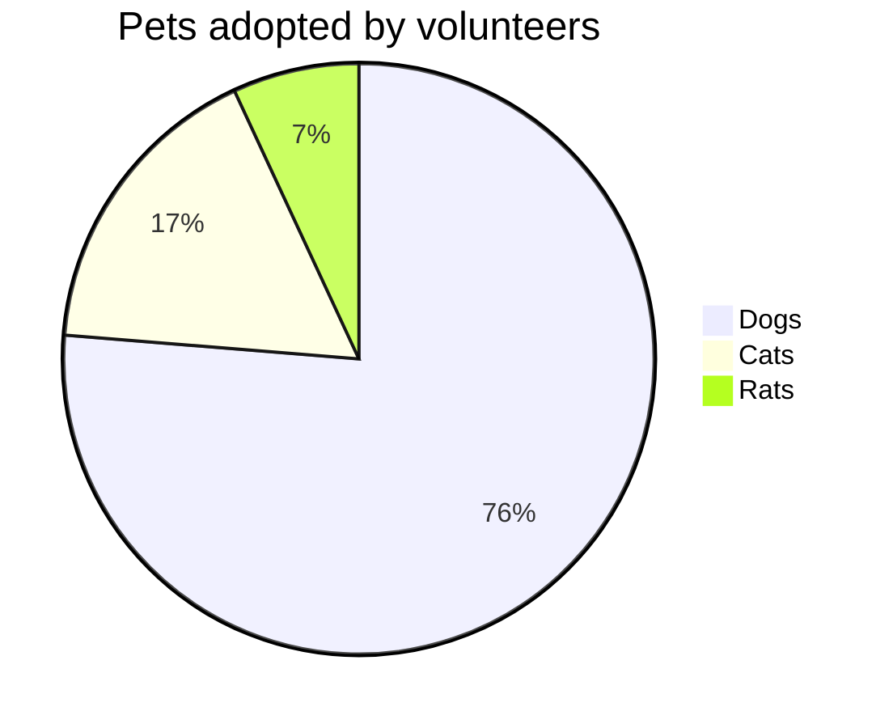
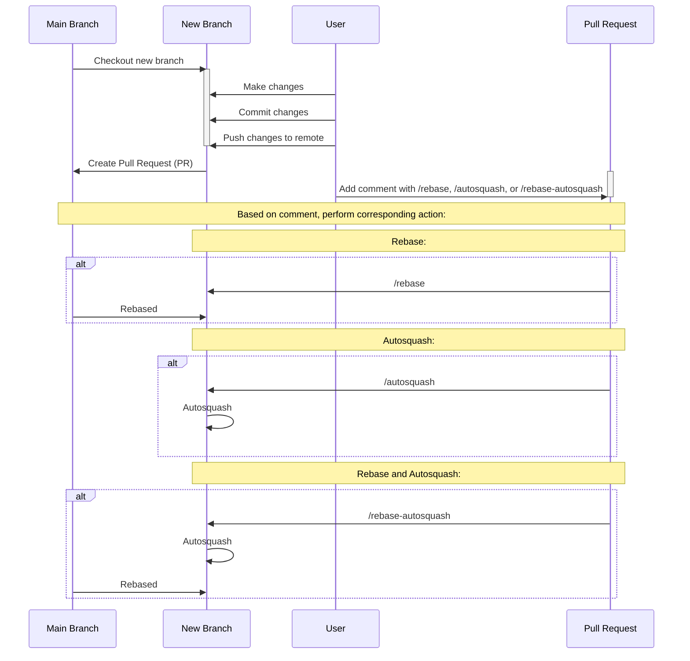
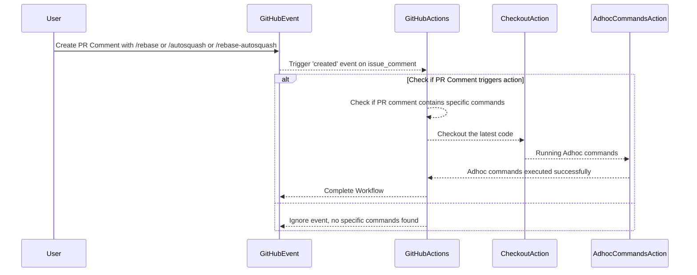

# GithubAction Runtime Adhoc PR Commands

<p align="center">
  
</p>

Automate custom commands on pull requests using GitHub Actions.

## Overview

This GitHub Action allows you to execute ad-hoc commands on pull requests dynamically in response to comments. It provides a flexible way to trigger specific tasks based on user interactions.


````markdown

````

## Sequence Diagram: Adhoc Commands Workflow



### 1. Main Branch to New Branch: Checkout and Changes

- The main branch initiates the creation of a new branch.
- The user makes changes in the new branch, commits them, and pushes the changes to the remote repository.

### 2. New Branch to Main Branch: Create Pull Request

- A pull request is created from the new branch to the main branch.

### 3. User to Pull Request: Trigger Commands

- The user adds a comment to the pull request with one of the following commands: `/rebase`, `/autosquash`, or `/rebase-autosquash`.

### 4. Based on Comment: Rebase, Autosquash, or Both

- If the comment contains `/rebase`, the main branch rebases onto the new branch.
- If the comment contains `/autosquash`, autosquashing is performed in the new branch.
- If the comment contains `/rebase-autosquash`, both rebase and autosquash actions are executed.

# Usage

### Workflow Setup

Create a GitHub Actions workflow YAML file, for example, `.github/workflows/adhoc_commands.yml`:

```yaml
name: PR Adhoc commands
on:
  issue_comment:
    types: [created]
jobs:
  build:
    name: PR-Adhoc-Commands
    runs-on: ubuntu-latest
    if: >-
      github.event.issue.pull_request != '' &&
      (
        contains(github.event.comment.body, '/rebase') ||
        contains(github.event.comment.body, '/autosquash') ||
        contains(github.event.comment.body, '/rebase-autosquash')
      )
    steps:
      - name: Checkout the latest code
        uses: actions/checkout@v3
        with:
          token: ${{ secrets.GITHUB_TOKEN }}
          fetch-depth: 0

      - name: Running Adhoc commands
        uses: GirishCodeAlchemy/githubaction-runtime-adhoc-pr-commands@v1
        with:
          autosquash: ${{ contains(github.event.comment.body, '/autosquash') || contains(github.event.comment.body, '/rebase-autosquash') }}
        env:
          GITHUB_TOKEN: ${{ secrets.GITHUB_TOKEN }}
```


## Github Action Adhoc Commands Workflow



## Sequence Diagram: GitHub Actions Workflow

### 1. User to GitHub Event: Trigger PR Comment

- The user creates a pull request comment with one of the commands: `/rebase`, `/autosquash`, or `/rebase-autosquash`.

### 2. GitHub Event to GitHub Actions: Event Trigger

- The GitHub event is triggered, specifically the 'created' event on `issue_comment`.

### 3. GitHub Actions to Checkout Action: Prepare Workflow

- GitHub Actions checks if the pull request comment contains specific commands.
- If commands are found, it proceeds to the next step; otherwise, the workflow is ignored.

### 4. Checkout Action to Adhoc Commands Action: Execute Commands

- GitHub Actions checks out the latest code.
- Adhoc Commands Action is triggered to run ad-hoc commands based on the user's comment.

### 5. Adhoc Commands Action to GitHub Actions: Successful Execution

- Adhoc commands are executed successfully, performing actions such as rebase, autosquash, or both.
- GitHub Actions acknowledges the successful execution.

### 6. GitHub Actions to GitHub Event: Complete Workflow

- The workflow is completed, and GitHub Actions updates the GitHub event accordingly.

### 7. GitHub Actions to GitHub Event: Ignore Workflow

- If no specific commands are found in the PR comment, GitHub Actions ignores the workflow.
